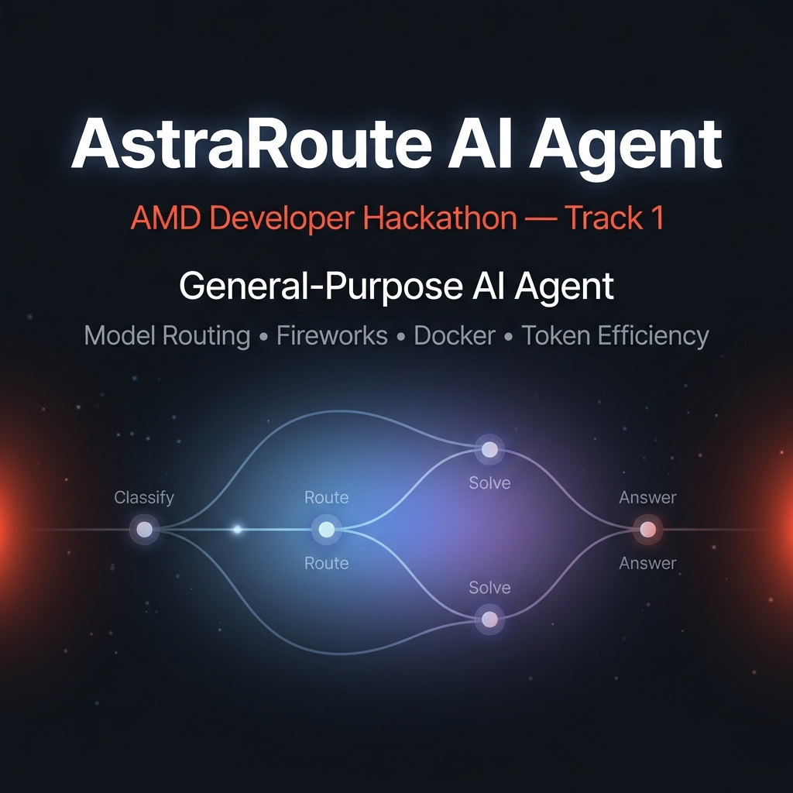

<div align="center">



# 🛰️ AstraRoute — AMD Developer Hackathon (ACT II) · Track 1 Agent

**A general-purpose AI agent that answers a batch of tasks accurately — for the fewest possible tokens.**

Deterministic zero-token solvers first · concise-correct model routing second · never a wasted call.

<br/>

[](https://amdhackathonn.streamlit.app/)

[](https://www.python.org/)
[](Dockerfile)
[](https://fireworks.ai/)
[](tests/)
[](LICENSE)
[](PRD.md)

</div>

---

> 🔗 **Live demo:** **<https://amdhackathonn.streamlit.app/>** — an interactive walkthrough of the routing / solver pipeline.
> 📄 **Single source of truth:** [`PRD.md`](PRD.md). This README is the quick orientation.

## 📑 Table of contents

- [What it is](#-what-it-is)
- [Why it wins on score](#-why-it-wins-on-score)
- [How it works](#-how-it-works)
- [I/O contract](#-io-contract)
- [Runtime environment](#-runtime-environment)
- [Repository layout](#-repository-layout)
- [Dependencies](#-dependencies-three-isolated-files)
- [Local development](#-local-development)
- [Docker (graded submission)](#-docker-graded-submission)
- [Demo UI](#-demo-ui)
- [Status](#-status)

## ✨ What it is

A general-purpose AI agent packaged as a **Python CLI batch container** (not a web app / server).
The grading harness pulls a public `linux/amd64` image, mounts an input file, injects env vars,
runs the container **once**, and scores the output.

<table>
<tr>
<td width="33%" valign="top">

### ⚡ Zero-token first
Deterministic local solvers answer clear-cut math & sentiment with **no API call at all** — free accuracy, zero tokens.

</td>
<td width="33%" valign="top">

### 🎯 Smart routing
An 8-type classifier picks the **concise-correct model** for each task, always filtered against the runtime allow-list.

</td>
<td width="33%" valign="top">

### 🛡️ Fail-safe batch
One call, `temperature=0`, bounded output. A single bad task **never sinks the batch** — it falls back and the run exits `0`.

</td>
</tr>
</table>

## 🏆 Why it wins on score

Scoring is a two-stage funnel — every design decision serves it:

| Stage | Rule | Our lever |
|------:|------|-----------|
| **1. Accuracy gate** | Binary LLM-judge threshold. Miss it → **excluded**. | Task-tuned prompts + per-type model selection + safe fallbacks. |
| **2. Token rank** | Among passers, ranked **ascending** by total Fireworks tokens. | Local solvers = **0 tokens**; short prompts; per-category output caps; one call/task. |

> **Grading VM:** CPU-only · 4 GB RAM / 2 vCPU · ≤10 GB image · ≤10 min total · <60 s startup · <30 s/request.
> _(The AMD GPU pod is for dev / fine-tuning only — it does not run the submission.)_

## 🧠 How it works

Each task flows through one deterministic pipeline (`app/main.py` → `solve`):

```
prompt
  └─ router.classify()            # zero-token heuristic → 1 of 8 task types
       └─ local_solvers.try_solve()   # deterministic answer if unambiguous → 0 tokens
            └─ (declines) router.pick_model()   # best model present in ALLOWED_MODELS
                 └─ fireworks_client.complete()  # 1 call · temp 0 · no stream · 404 model-fallback
```

**Token levers, in priority order**

1. **Deterministic local solvers** (`app/local_solvers.py`) — precision-first math
   (sum / average / product / percentage-remaining / binary arithmetic) and clear-cut
   sentiment, answered with **zero tokens**; ambiguous cases defer to the model.
2. **Short, task-specific system prompts** (`app/prompts.py`) steering concise English,
   plus **per-category output-token ceilings**.
3. **One call per task**, `temperature=0`, no chain-of-thought, no runaway retries — the
   only retry is a model fallback when an allowed model returns `404` (not deployed).
4. **Concise-correct model per task type** (`app/router.py`), always filtered against the
   runtime `ALLOWED_MODELS`. Optional launch-day override via `MODEL_OVERRIDE_<TASKTYPE>`.

**Supported task types:** `math` · `sentiment` · `ner` · `summary` · `code` · `reasoning` · `factual` · `general`

## 🔌 I/O contract

- **Read** `/input/tasks.json` — an array of `{ "task_id": str, "prompt": str }`.
- **Write** `/output/results.json` — an array of `{ "task_id": str, "answer": str }`,
  one result per task, answers in English, then **exit 0**.
- Per-task failure fallback answer: `"Unable to determine."` — one bad task never sinks the batch.

## ⚙️ Runtime environment

Injected by the harness — read at runtime, **never** hardcoded:

| Var | Purpose |
|-----|---------|
| `FIREWORKS_API_KEY` | Fireworks auth. **Secret.** |
| `FIREWORKS_BASE_URL` | OpenAI-compatible endpoint; **all** model calls go through it. |
| `ALLOWED_MODELS` | Comma-separated allowed model IDs. Read at runtime. |
| `FIREWORKS_TIMEOUT` | _(optional)_ per-request timeout override; defaults to `25` s. |

> 🔒 **Hard rules:** never hardcode API keys or model IDs · never bundle a `.env` · always
> read config from the environment · never return a model absent from `ALLOWED_MODELS`.

## 🗂️ Repository layout

```
app/
  main.py              # batch entrypoint: read → solve each task → write → exit 0
  config.py            # runtime Config loaded from injected env vars
  schema.py            # pydantic Task / Result models (the I/O contract)
  io_utils.py          # read tasks / write results, /input & /output paths
  router.py            # classify() + pick_model() — deterministic, zero-token
  local_solvers.py     # zero-token math & sentiment solvers
  prompts.py           # short system prompts + per-category output-token caps
  fireworks_client.py  # OpenAI-compatible Fireworks wrapper (temp 0, 404 fallback)
tests/                 # pytest suite (67 passing)
input/                 # sample tasks.json for local runs
output/                # results.json is written here (git-ignored)
practice/              # local practice set + evaluate.py harness + eval notes
streamlit_app.py       # AstraRoute demo UI (Streamlit Cloud only — never in the image)
Dockerfile             # graded image — installs requirements-image.txt ONLY
PRD.md                 # full product / requirements doc — source of truth
```

## 📦 Dependencies (three isolated files)

| File | Used by | Contents |
|------|---------|----------|
| `requirements-image.txt` | **The graded Docker image only** | pinned `openai` + `pydantic` — nothing else |
| `requirements-dev.txt` | Local tests | `-r requirements-image.txt` + `pytest` + `python-dotenv` |
| `requirements.txt` | Streamlit Cloud demo only | `-r requirements-image.txt` + `streamlit` + `python-dotenv` |

> ⛔ **The graded image must install ONLY `requirements-image.txt`.** Adding demo/UI/dev
> deps (streamlit, pandas, …) to the image once broke the `openai` runtime via transitive
> deps, so every model call fell back to `"Unable to determine."` → a **0% submission** that
> still built green and exited `0`. Full post-mortem + pre-submit guard in [`AGENTS.md`](AGENTS.md).

## 💻 Local development

```bash
python -m venv .venv && source .venv/bin/activate   # Windows: .venv\Scripts\activate
pip install -r requirements-dev.txt
cp .env.example .env        # fill in your Fireworks values (never commit .env)
pytest                      # run the test suite (67 passing)
```

Offline accuracy check against the local practice set:

```bash
python -m practice.evaluate   # writes practice/eval_report.json
```

## 🐳 Docker (graded submission)

```bash
docker build -t amd-track1-agent .

docker run --rm -e FIREWORKS_API_KEY -e FIREWORKS_BASE_URL -e ALLOWED_MODELS \
  -v "$PWD/input:/input" -v "$PWD/output:/output" amd-track1-agent

# ✅ Pre-submit guard — MUST pass (no streamlit in image, openai imports cleanly):
docker run --rm amd-track1-agent python -c \
  "import importlib.util as u; assert u.find_spec('streamlit') is None; \
   from openai import OpenAI; print('image clean')"
```

## 🎨 Demo UI

**▶ <https://amdhackathonn.streamlit.app/>**

An optional Streamlit demo — **AstraRoute** (`streamlit_app.py`) — visualizes the classify →
solve → route → answer pipeline. It is deployed via Streamlit Community Cloud (which reads
`requirements.txt`) and is **completely separate from the graded image** — it must never be
added to the container.

## 📌 Status

Core agent complete and green: full **classify → local-solve → route → Fireworks** pipeline,
deterministic zero-token math / sentiment solvers, per-category token caps, three-way dependency
isolation, Dockerfile, and **67 passing tests**. Remaining stretch items (fine-tuned router,
local generative model) are optional per PRD §21.

---

<div align="center">

Built for the **AMD Developer Hackathon (ACT II) · Track 1** · Licensed under [MIT](LICENSE)

<sub>⭐ If this helped, give the repo a star.</sub>

</div>
